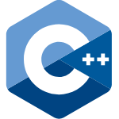
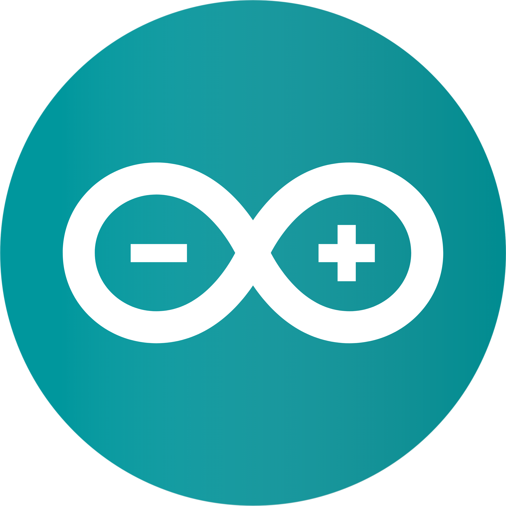
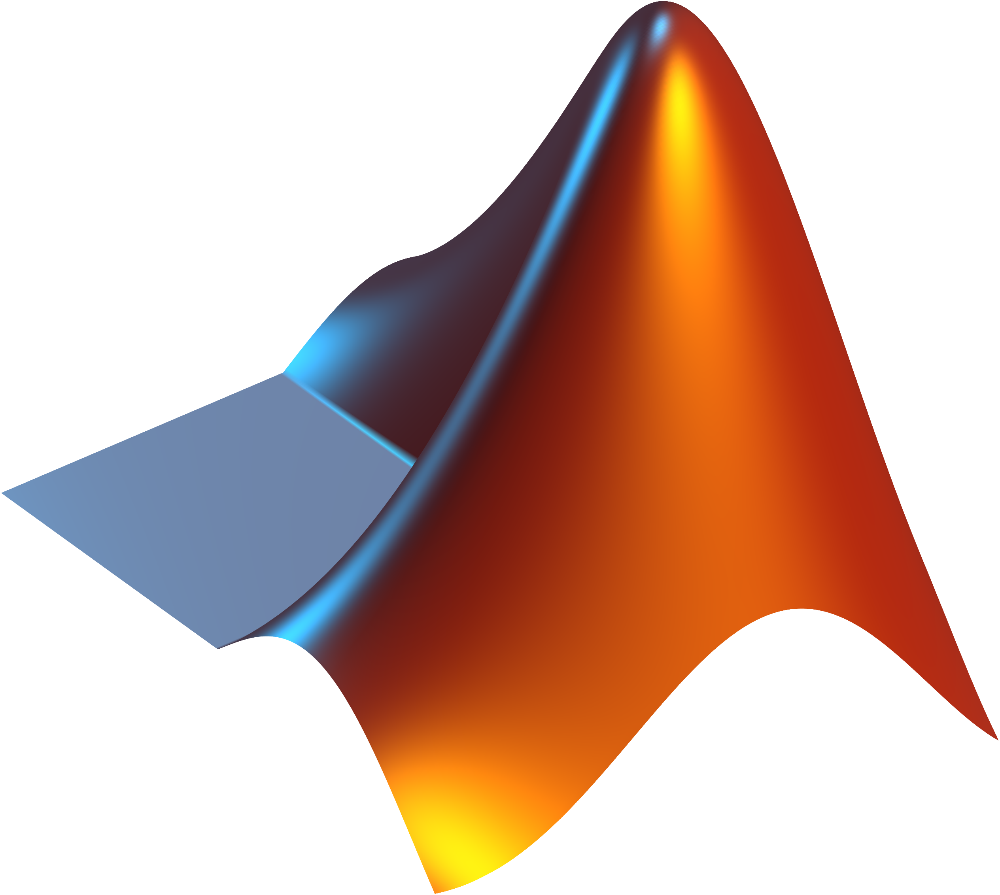
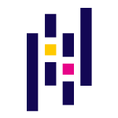
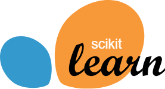
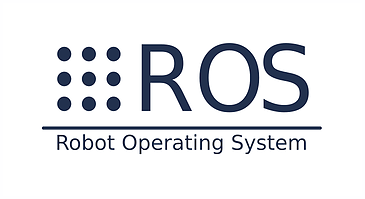
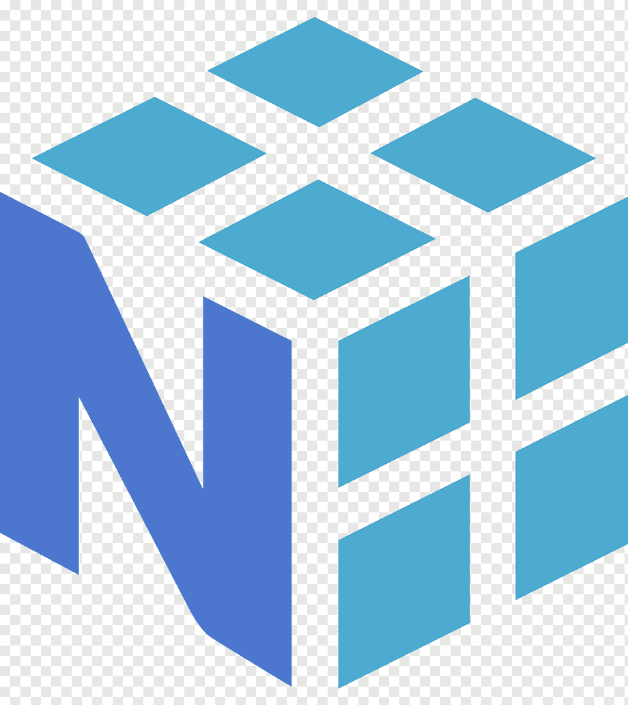
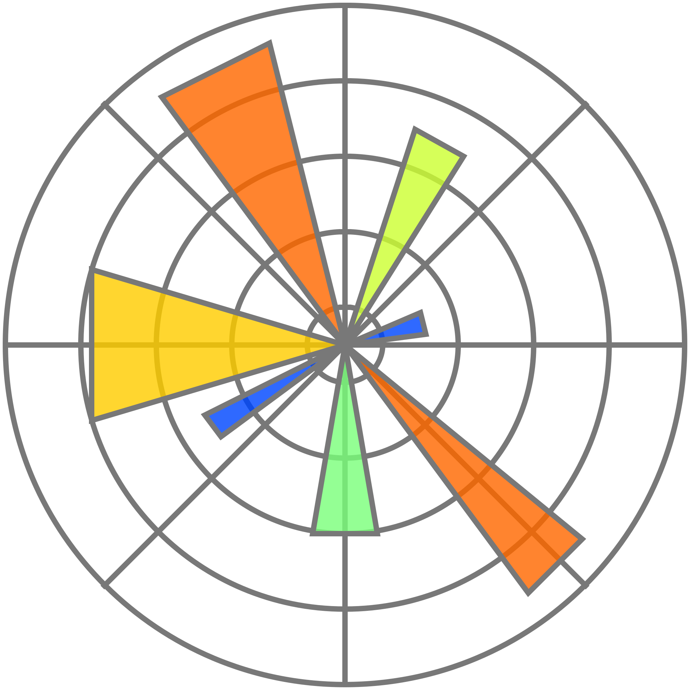
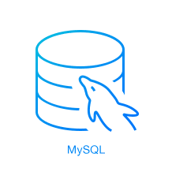
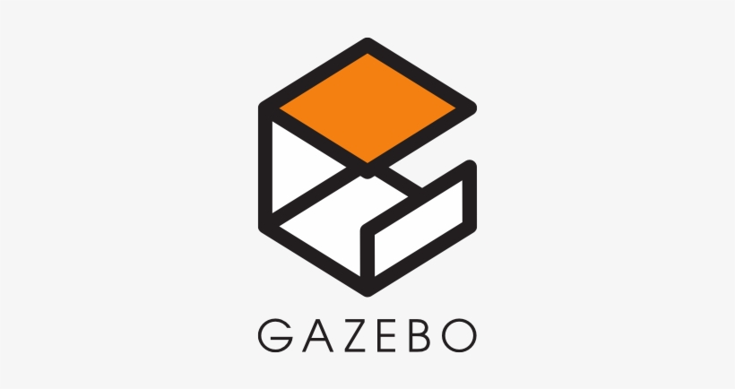

<!-- 
 -->
<!--               -->
<!--   -->

<h3 align="center"><strong> Mechatronics Engineer currently pursuing my master's degree in Robotics and AI </strong></h3>

<ul>
<li>🔭 Interested in:
**Artificial Intelligence ..Computer Vision ..Deep Learning ..Robotic Systems** </li>
<li>🔧 Currently Working on:
  **3d Point Cloud ..Depth Cameras ..Self-supervised Learning** </li>
<li>👨‍💻 All of my projects are available at https://github.com/SabihShah </li>
<li>💬 Ask me about Deep Learning, Computer Vision, C++, Python, Robotics OS</li>
<li>📫 How to reach me: sabihshah999@gmail.com</li>
</ul>

### 🛠️ &nbsp;Languages and Tools:

&nbsp;
&nbsp;
&nbsp;
&nbsp;
&nbsp;
&nbsp;
&nbsp;
&nbsp;
&nbsp;
&nbsp;
&nbsp;
&nbsp;
&nbsp;

### :link: &nbsp;Contact Info

<!-- 

    
    
    
    
    
    
    
    
    
    
    
    
    
    
    
    

 -->
